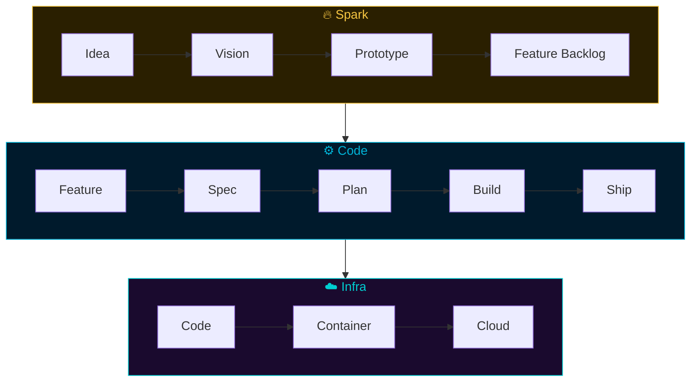
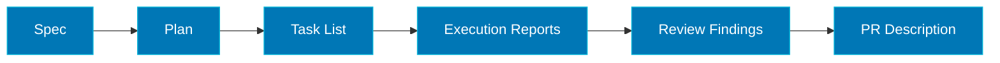

# Core Concepts

Arness has 135 components across three plugins. You interact with 7 entry points. This page explains the architecture that makes that possible.

## How Arness Is Organized

### Entry Points (7 total)

Commands you type to start a workflow. These are the only commands you need to remember. Each one detects your project state, asks the right questions, and orchestrates the skills and agents needed to complete the job.

Claude Code commonly shows these with a slash prefix. In Codex, use the same names in prompts, for example `codex "arn-planning add rate limiting"` or `codex "arn-brainstorming a budgeting app"`.

```
/arn-brainstorming    Spark — product discovery through feature extraction
/arn-planning         Code  — spec, plan, build, review, ship
/arn-implementing     Code  — resume or execute an existing plan
/arn-shipping         Code  — commit, push, create PR
/arn-reviewing-pr     Code  — validate and act on PR feedback
/arn-assessing        Code  — comprehensive codebase review
/arn-infra-wizard     Infra — infrastructure end-to-end
```

### Skills (88 total)

Pipeline steps that entry points orchestrate automatically. Each skill is a natural-language instruction file (`SKILL.md`) that defines a specific workflow stage — from "develop a feature specification" to "generate CI/CD pipelines."

You *can* invoke skills directly (e.g., `/arn-code-feature-spec`), and experienced users often do for targeted work. But you rarely *need* to — the entry points handle routing.

### Agents (47 total)

Specialist AI workers that skills dispatch behind the scenes. An agent is tuned for a specific domain — architecture design, security analysis, cost estimation, prototype building, brand naming — with its own set of tools and expertise.

You never invoke agents directly. When a skill needs deep expertise, it spawns the right agent automatically. For example, `/arn-planning` invokes the architect agent during spec refinement and the feature-planner agent during plan generation.

## The Three Plugins

```
plugins/
├── arn-spark/       28 skills + 20 agents   Product discovery & prototyping
├── arn-code/        35 skills + 17 agents   Development pipeline
└── arn-infra/       25 skills + 10 agents   Infrastructure & deployment
```

Each plugin installs independently and delivers full value on its own. Together, they form a continuous pipeline:



**Cross-plugin handoffs** happen at natural boundaries:
- Spark's `/arn-spark-feature-extract` produces feature files that Code's `/arn-planning` consumes
- Code's shipped artifacts feed Infra's deployment pipeline
- These handoffs are a bonus for multi-plugin users, not a requirement for single-plugin users

## Graduated Ceremony

Not every change needs the same level of process. Arness operates at three ceremony tiers:

| Tier | Scope | What happens |
|------|-------|-------------|
| **Swift** | 1-8 files, small changes | Lightweight change record, minimal gates. For renames, config changes, small refactors, hotfixes. |
| **Standard** | Medium-scope features | Spec-lite and task-tracked execution. Bridges swift and thorough. |
| **Thorough** | Complex features, architectural changes | Full pipeline with all stages, quality gates, and review loops. |

Arness detects complexity and suggests the appropriate tier. You can always override to a higher or lower tier.

## The Artifact Chain

Every stage produces durable files — Markdown specs, JSON progress reports, plan previews, review findings. These artifacts serve dual purposes:

1. **Guide the AI** — future sessions load relevant artifacts for context continuity
2. **Document decisions** — a new team member reads the spec, plan, and implementation report and understands what was decided and why

The chain flows through the pipeline:



Each artifact feeds the next stage's input. Nothing is orphaned, nothing is lost between sessions.

All artifacts live in `.arness/` at your project root — organized by type (specs, plans, reports, docs). Your source tree stays clean.

## Configuration

Arness stores its configuration in two places:

### Project configuration (`CLAUDE.md`)

An `## Arness` section in your project's `CLAUDE.md` holds structural settings: directory paths, template preferences, platform detection results, and feature flags. This is committed to your repo and shared across the team.

### User profile

Your role, experience level, preferred tech stack, and development conventions are captured on first run and stored in your user directory. This profile is reused across all projects — Arness asks once and remembers.

### Progressive zero-config

You don't need to configure anything upfront. If you skip init and invoke a skill directly, Arness auto-configures with sensible defaults. Configuration surfaces only when a specific skill first needs it. Time-to-value matches or beats your existing workflow from the first session.

## Integrations

Arness connects to external services through CLIs and [MCP servers](https://modelcontextprotocol.io/):

| Service | Method | Used by |
|---------|--------|---------|
| GitHub | `gh` CLI | Code, Infra — PRs, issues, CI |
| Bitbucket | `bkt` CLI | Code, Infra — PRs, issues, pipelines |
| Jira | Atlassian MCP | Code — issue tracking, backlog browsing |
| Figma | Figma MCP | Spark — style exploration, design grounding |
| Canva | Canva MCP | Spark — asset export, brand grounding |

All integrations are optional. Arness detects what's available during init and adapts accordingly.

See the [full integrations reference](reference/integrations.md) for details.
